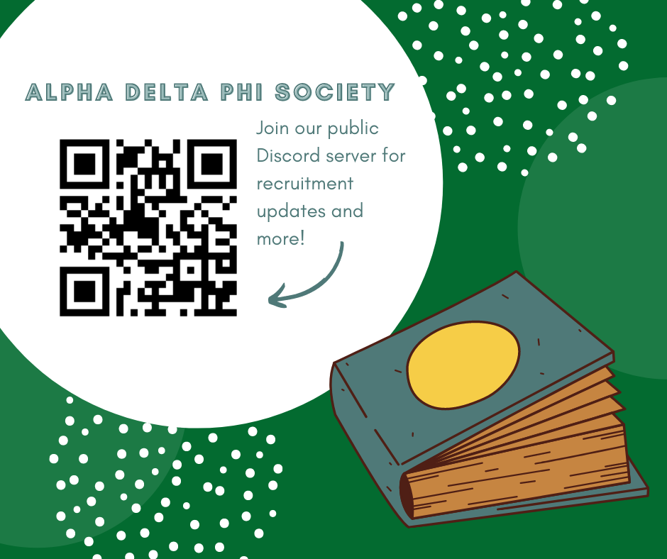

# About Us

The Alpha Delta Phi Society is a gender-inclusive and interdisciplinary national Greek organization that specializes in cultivating literary and artistic endeavors across college campuses. We value Siblinghood, diversity, and inclusion and are dedicated to fostering intellectual and personal growth. The Society provides students with distinct leadership experiences, scholarship opportunities, and a support network that lasts beyond a Sibling’s undergraduate education.

* * *

## At Rensselaer

We understand that the focus of our students lies deep within Science, Technology, Engineering, and Mathematics, which is why our Siblings choose to embody a non-traditional definition of literature. Our goal is to bridge the gap between the sciences and the humanities through self-exploration and free thought. We accept all forms of ingenuity from reading and writing, to painting, to map-making, to baking, to philosophy. Our membership and social events vary widely each semester based on our members’ interests at the time and are usually focused on some sort of humanitarian aspect that we don’t see in our classes or homework.

* * *

## Frequently Asked Questions

### Are you guys a Fraternity/sorority?

No! We are a national Greek Society that is not associated with RPI’s Inter-fraternity or Panhellenic councils, but we do share Greek traditions such as rushing and pledging. We are gender-inclusive and provide a different kind of Greek experience at RPI.

### What do you do?

We aim to bring a greater sense of creativity to RPI through events that allow students to naturally express themselves. Our members are empowered to individually pave their own paths toward success at RPI.

### How much does it cost to join?

Dues for our chapter range from $175-$225 every semester, but we believe that money should never be a deciding factor when considering joining. We run a financial aid program for our siblings to offer need- and merit-based scholarships as well as payment plans that are tailored to each individual sibling who requests aid.

### How do I join?

We hold rush events and an extended recruitment period each semester and we initiate members after a 3-4 week education period. Rush events are open to the public and are designed to be inclusive and interactive; we want to get to know you! During the education period, our Pledges learn about the history of the Society and get to personally know the other Siblings of our Chapter.

### Do you guys haze?

Absolutely not. The pledging period is designed to be informative and fun, not traumatic. Our ideals focus on respecting ourselves and our Siblings and we do not tolerate any mental or physical hazing of any kind.
