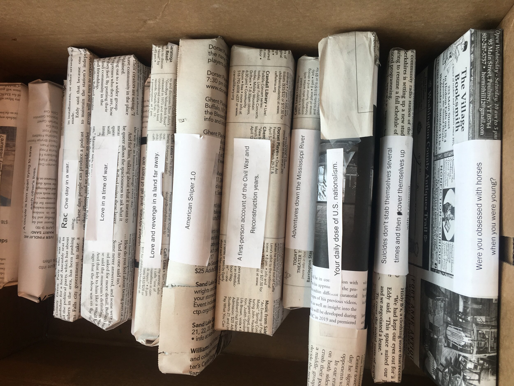

# Philanthropy Events

## Blind Date with a Book

Each semester, our Chapter organizes a public Blind Date with a Book fundraising event. Our Siblings collect, wrap, and label hundreds of books that are sold in our Student Union. The book titles are hidden, so when someone purchases a book it’s as if they’re going on a blind date! The proceeds from the event are either used for a local charity that supports literacy and free thought or our internal financial aid program to help support Siblings.

* * *

## Sticker Sales

We also organize a sticker sale every semester! Students love to put stickers on their laptops and we figured that we could offer a cheaper alternative to some of the online sticker companies. Proceeds from this event are used for our internal Financial Aid program to help support our Siblings.
