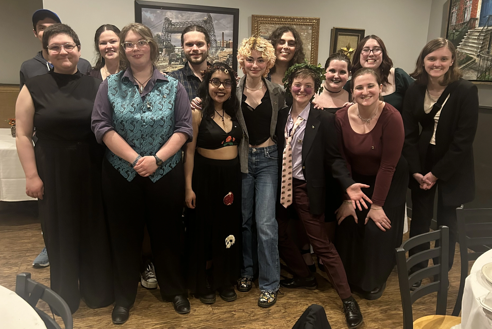
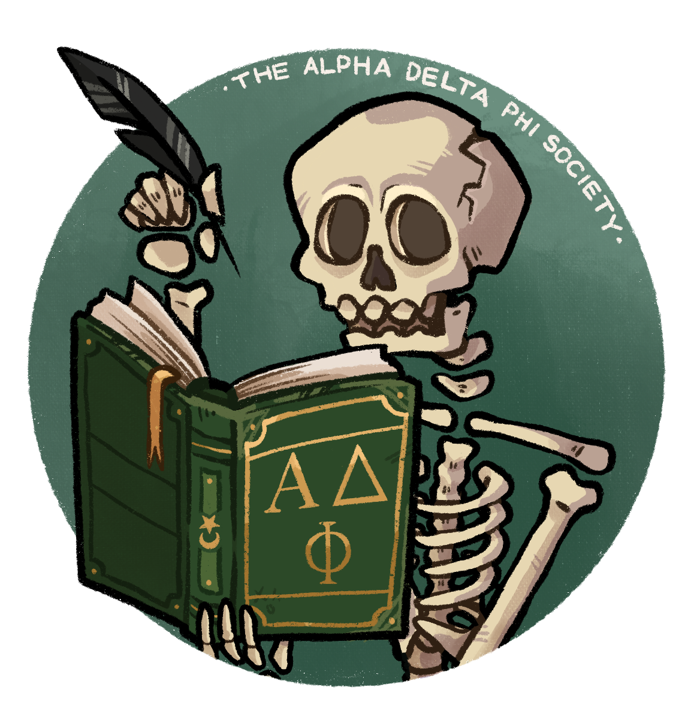

# Greek Differently.

### The Rensselaer Chapter of the Alpha Delta Phi Society was founded in 2015 by a group of freshmen who agreed that RPI's strict focus on STEM subjects needed to be supplemented with a creative and interdisciplinary space that challenged the traditions of the school. We are rather chaotic and proudly represent a broad definition of literature and arts across our campus.

[_We Support the Black Lives Matter Movement_](https://www.adps.org/blacklivesmatter/)
